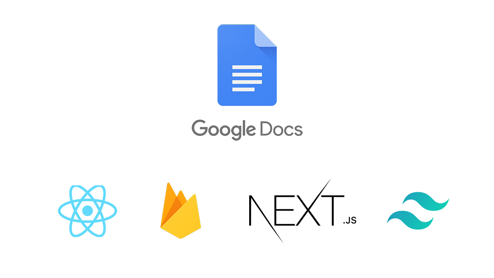
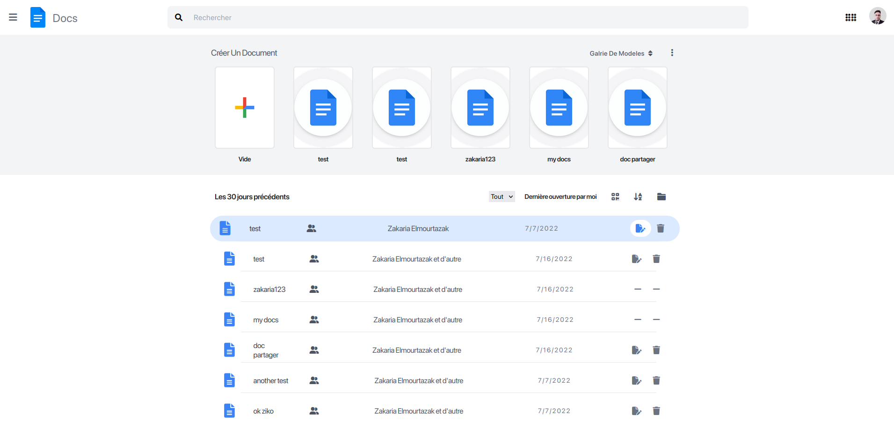

## GoogleDocs Clone Next.js + firebase + tailwindCss
> Functional GoogleDocs Clone written in javaScript using nextjs and Firebase


 <h1 align="center">
  <br>
 
  <br/>
</h1>


This project was bootstrapped with [reat Next App](https://nextjs.org/docs), using the [tailwindCss](https://tailwindcss.com/).
just change the firebase

To test the googleDocs application
you have to install the firebase first

### `npm i firebase`

change the firebase config by your firebase config and you don't forget to enable the google authentification

finaly run your project by 

### `yarn run dev`

**Note: don't forget to install the dependancy of the project!**

### `yarn`

URL of application 
>https://googleDocs-clone-38799.web.app/login

<h1 align="center">
  <br>
  
 
    <br> <br>
  Main page
  <br/>
</h1>

<h1 align="center">
  <br>
  
 
    <br> <br>
  Doc page
  <br/>
</h1>

<h1 align="center">
  <br>
 
  <br>
   <br> <br>
   Login page
  <br>
</h1>


## Features

Implemented Features

- [x] switch user
- [x] login and logout
- [x] Local Authentication width google acompt
- [x] sort documents
- [x] CRUD operation
- [x] filter document by priority
- [x] share functionality with email
- [x] write intothe document (WYSWYG)
- [x] add shared document priority
- [x] responsive fonctionality

## Available Scripts

In the project directory, you can run:

### `yarn run dev`

Runs the app in the development mode.\
Open [http://localhost:3000](http://localhost:3000) to view it in your browser.

The page will reload when you make changes.\
You may also see any lint errors in the console.

### `yarn test`

Launches the test runner in the interactive watch mode.\
See the section about [running tests](https://facebook.github.io/create-react-app/docs/running-tests) for more information.

### `yarn run build`

Builds the app for production to the `build` folder.\
It correctly bundles React in production mode and optimizes the build for the best performance.

The build is minified and the filenames include the hashes.\
Your app is ready to be deployed!

See the section about [deployment](https://facebook.github.io/create-react-app/docs/deployment) for more information.

### `yarn run eject`

**Note: this is a one-way operation. Once you `eject`, you can't go back!**

If you aren't satisfied with the build tool and configuration choices, you can `eject` at any time. This command will remove the single build dependency from your project.

Instead, it will copy all the configuration files and the transitive dependencies (webpack, Babel, ESLint, etc) right into your project so you have full control over them. All of the commands except `eject` will still work, but they will point to the copied scripts so you can tweak them. At this point you're on your own.

You don't have to ever use `eject`. The curated feature set is suitable for small and middle deployments, and you shouldn't feel obligated to use this feature. However we understand that this tool wouldn't be useful if you couldn't customize it when you are ready for it.


# Next.js + Tailwind CSS Example

This example shows how to use [Tailwind CSS](https://tailwindcss.com/) [(v3.0)](https://tailwindcss.com/blog/tailwindcss-v3) with Next.js. It follows the steps outlined in the official [Tailwind docs](https://tailwindcss.com/docs/guides/nextjs).

## Deploy your own

Deploy the example using [Vercel](https://vercel.com?utm_source=github&utm_medium=readme&utm_campaign=next-example) or preview live with [StackBlitz](https://stackblitz.com/github/vercel/next.js/tree/canary/examples/with-tailwindcss)

[](https://vercel.com/new/git/external?repository-url=https://github.com/vercel/next.js/tree/canary/examples/with-tailwindcss&project-name=with-tailwindcss&repository-name=with-tailwindcss)

## How to use

Execute [`create-next-app`](https://github.com/vercel/next.js/tree/canary/packages/create-next-app) with [npm](https://docs.npmjs.com/cli/init), [Yarn](https://yarnpkg.com/lang/en/docs/cli/create/), or [pnpm](https://pnpm.io) to bootstrap the example:

```bash
npx create-next-app --example with-tailwindcss with-tailwindcss-app
# or
yarn create next-app --example with-tailwindcss with-tailwindcss-app
# or
pnpm create next-app --example with-tailwindcss with-tailwindcss-app
```

Deploy it to the cloud with [Vercel](https://vercel.com/new?utm_source=github&utm_medium=readme&utm_campaign=next-example) ([Documentation](https://nextjs.org/docs/deployment)).
